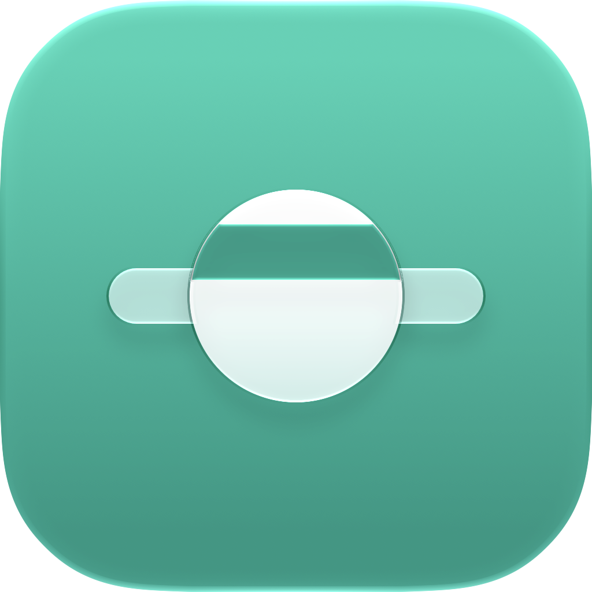
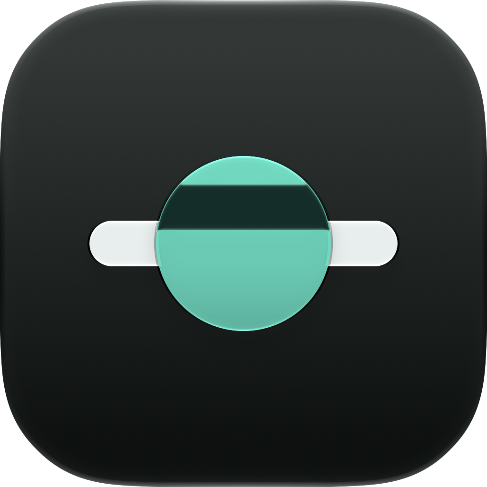
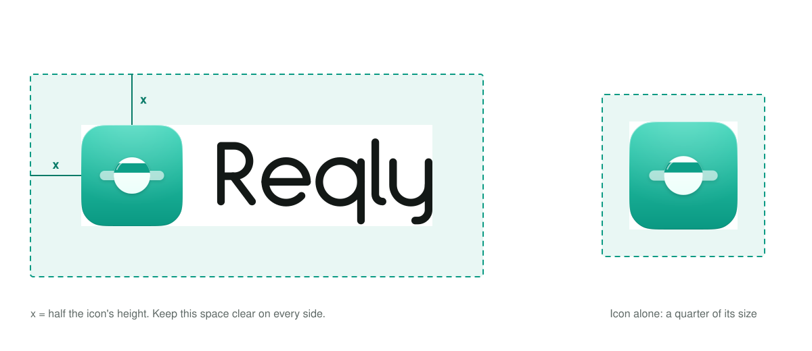
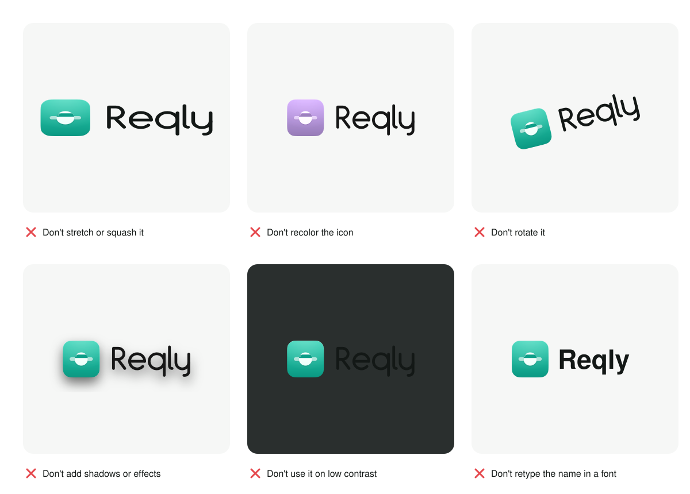
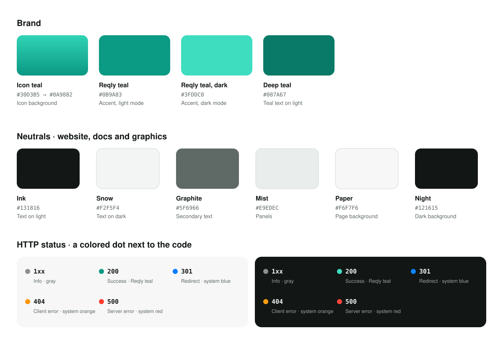

<p align="center">
  <picture>
    <source media="(prefers-color-scheme: dark)" srcset="logo/lockup/reqly-lockup-on-dark.svg">
    
  </picture>
</p>

# Reqly design guidelines

Reqly's logo, colors, type and icons. The logo files and their technical details are in [logo/README.md](logo/README.md).

- [1. Logo and brand](#1-logo-and-brand)
- [2. Color](#2-color)
- [3. Typography](#3-typography)
- [4. Icons](#4-icons)

## 1. Logo and brand

### The icon

 

A glass disc sits on a line of traffic. Seen through the glass, the line shifts: Reqly lets you see into your traffic.

The app icon's single source is [`logo/Reqly.icon`](logo/Reqly.icon), an Icon Composer document. From it, macOS and iOS render the default, dark, tinted and clear appearances. Never ship an app icon made from any other file.

### The wordmark

"Reqly" is drawn letter by letter. It is not a font, so never retype the name to make a logo; always use the SVG files in [`logo/wordmark/`](logo/wordmark). The wordmark is always a single neutral color: Ink on light backgrounds and Snow on dark ones. Teal belongs to the icon.

### The logo

The icon and wordmark side by side are the logo. It comes in versions for light and dark backgrounds, in [`logo/lockup/`](logo/lockup).

| Use | When |
|---|---|
| Logo (icon and wordmark) | READMEs, the website, social images: anywhere the name isn't already obvious |
| Icon alone | Inside the app, favicons, small spaces |
| Wordmark alone | Only when the icon is already shown nearby |

On GitHub, this header switches between the light and dark versions with the viewer's theme:

```html
<p align="center">
  <picture>
    <source media="(prefers-color-scheme: dark)" srcset="design/logo/lockup/reqly-lockup-on-dark.svg">
    
  </picture>
</p>
```

### Clear space and minimum size



Around the logo, keep empty space equal to half the icon's height. Around the icon alone, keep a quarter of its size.

| Element | Smallest size |
|---|---|
| Logo | 100 px wide |
| Wordmark alone | 20 px tall |
| App icon | 16 pt. macOS draws the small sizes itself. |

### Don't



- Don't stretch, squash or rotate the logo.
- Don't recolor the icon or make the wordmark teal.
- Don't add shadows, outlines, glows or other effects.
- Don't place it on busy or low-contrast backgrounds. Use the version made for light or dark.
- Don't retype "Reqly" in a font or change the space between the icon and the wordmark.

### Who may use the logo

The code is MIT-licensed, but the Reqly name, icon and wordmark are reserved. Anyone may use them unchanged to refer to Reqly, but modified versions need their own name and icon. The full rules are in [TRADEMARKS.md](../TRADEMARKS.md).

### Menu-bar icon

The menu bar uses [`logo/menubar/MenuBarIcon.imageset`](logo/menubar/MenuBarIcon.imageset). It is a template image, so macOS colors it for light and dark menu bars. Never color it or put the full app icon in the menu bar.

## 2. Color



### Brand colors

| Name | Value | Use |
|---|---|---|
| Icon teal | `#30D3B5` → `#0A9882` | The app icon background only |
| Reqly teal | `#0B9A83` (light), `#3FDDC0` (dark) | Accent color and brand moments |
| Deep teal | `#087A67` | Teal text on light backgrounds, such as links |
| Ink | `#131816` | Text on light backgrounds |
| Snow | `#F2F5F4` | Text on dark backgrounds |
| Graphite | `#5F6966` | Secondary text |
| Mist | `#E9EDEC` | Panels |
| Paper | `#F6F7F6` | Page background |
| Night | `#121615` | Dark background |

The neutrals are for the website, docs and graphics. Inside the app, use system colors instead.

### Color in the app

- **Use system colors.** For text, backgrounds and separators, use macOS's semantic colors (label, secondary label, separator, window and control backgrounds). They adapt to light mode, dark mode and increased contrast on their own. Don't hard-code hex values for interface colors.
- **Follow the user's accent color.** The app's `AccentColor` asset is Reqly teal (`#0B9A83` for light, `#3FDDC0` for dark). macOS shows it when the user's accent color is set to Multicolor, the default. Otherwise buttons and selections use the color the user chose. Never hard-code teal for controls or selection.
- **Keep brand moments teal.** The icon, the About window and onboarding artwork always use teal.
- **Give every color a meaning.** Color marks selection, status, errors and highlights in search results. Nothing decorative.

### HTTP status colors

| Status | Color |
|---|---|
| 1xx Informational | System gray |
| 2xx Success | Reqly teal |
| 3xx Redirect | System blue |
| 4xx Client error | System orange |
| 5xx Server error | System red |
| Failed, no response | System red, with a warning symbol |

- The color sits in a small dot next to the status code. The code itself stays in the normal text color, because orange or red text on a light background is too faint to read.
- Methods such as GET and POST are neutral text. Only the status carries color.
- Never rely on color alone. The code number and its label always say the same thing as the color.

### Light and dark

Reqly follows the system appearance. Design and check every screen in both light and dark mode, and with Increase Contrast turned on.

## 3. Typography

The app uses **SF Pro**, Apple's system font, through the built-in text styles. It uses **SF Mono** for request and response bodies, headers and any raw data.

| Text style | Size and weight (macOS) | Use in Reqly |
|---|---|---|
| Large Title | 26 pt, regular | Empty screens, onboarding |
| Title 1 | 22 pt, regular | Main window titles, rarely |
| Title 2 | 17 pt, regular | Section titles in the detail view |
| Title 3 | 15 pt, regular | Group titles |
| Headline | 13 pt, bold | Emphasis inside lists and panes |
| Body | 13 pt, regular | Most text, including URLs in the request list |
| Callout | 12 pt, regular | Secondary information |
| Subheadline | 11 pt, regular | Metadata such as timing and size |
| Footnote | 10 pt, regular | Hints and fine print |

- Use text styles, not fixed point sizes, so text respects the user's settings.
- Numbers in columns (timings, sizes, counts) use monospaced digits, such as `.monospacedDigit()` in SwiftUI, so they line up.
- Don't use SF Pro Rounded or custom fonts in the interface. The friendly, rounded voice lives in the wordmark and the icon.
- The website and docs use the system font stack (`-apple-system, BlinkMacSystemFont, "Segoe UI", sans-serif`) and `ui-monospace` for code.

## 4. Icons

- Use SF Symbols for every interface icon, matching the size and weight of the text next to it.
- Symbols are monochrome unless their color carries meaning, such as a red warning.
- Draw a custom symbol only when SF Symbols has nothing suitable. Build it as a custom SF Symbol in the same line style.
